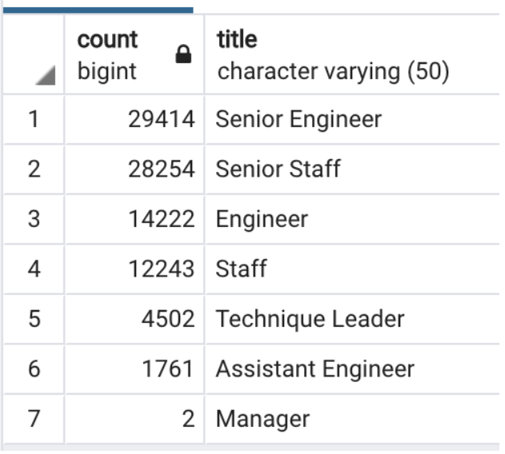

# Pewlett Hackard Analysis

## Overview

A manager at Pewlett Hackard has tasked Bobby to use his SQL skills to determine the number of reitiring employees per title and identify employees who are eligible to participate in a mentorship program. Bobby has asked for help in performing this task. The data is located in 6 different .csv files provided by the manager. Bobby's manager is requesting this information to learn about the age of the employees in the company and determine the number of employees nearing retirement age.  

## Results

- A significant number of Pewlett Hackard employees are at or are nearing retirement age. According to the chart below, around 90,000 employees are near retirement. This chart lists the number of employees that hold each job title that are near retiement. This is cause for alarm as this is nearly 1/3 of Pewlett Hackards 300,000 employees. 
      
      
     
- To help determine which employees are close to retirement and to help narrow down their retirment date, a retirement_titles.csv is available in the data folder that includes employee number, first name, last name, title, from date (hire date), and to date (retirement date, or 1/1/9999 if currently employed).

- With a large number of employees leaving the company, this means that a large number of new hires will be joining. To help with employee retention and training, it is important to provide the new hires with a mentor who has spent some time with the company. The employee number, first name, last name, birth date, from date (hire date), to date (retirement date), and title are provided in the mentorship_eligibility.csv file in the data folder. 

- Based on the mentorship_eligibility.csv file, there aren't enough employess born in 1965 to fully run the mentorship program. There are roughly 1550 employees born in 1965 that are still employeed with the company. They will need to broaden the age range to fill the mentorship program. 

## Analysis - Provide high-level responses to the following questions, then provide two additional queries or tables that may provide more insight into the upcoming "silver tsunami."

- How many roles will need to be filled as the "silver tsunami" begins to make an impact?

Taking a count of the indivual titles in the unique_titles.csv, it is determined that 90,398 employees will be appraching retirement. This can be found by using the following code in SQL. 

            SELECT COUNT (emp_no)
            FROM unique_titles;

- Are there enough qualified, retirement-ready employees in the departments to mentor the next generation of Pewlett Hackard employees?

No. Using the following code in SQL it is determined that there are 1549 retiremnet ready employees who would be a good fit for the mentor program. A suggestion is to open the mentor program to people bord outside of 1965.

            SELECT COUNT (emp_no)
            FROM mentorship_eligibility;
